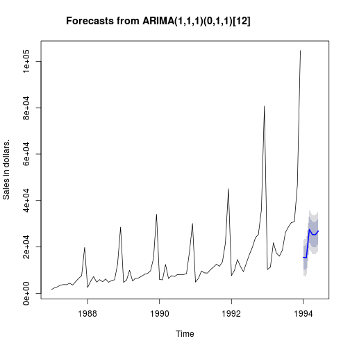

## Introduction

* All companies that offers products possibly must face with one or more of the following problems: 
  1. Losing clients for being out of stocks. 
  2. How to decide when to buy and how much. 
  3. Having an excessive inventory.

--- .class #id 

## The problem of modelling the demand 

* To sort the preceding problems out, firstly we must know the demand behaviour of the product or products through the time. 

* With this information, we will develop statistical models to generate accurate demand forecast. 

* There are many approach to model demand such as exponential smoothing models, state space models, ARIMA models, and so on.

* Finally, an application must be developed in order to allow potential users generate forecast without any knowledge of statistical software.

--- .class #id 

## Monthly demand forecasting application 

* An shiny application was developed with monthly sales for a souvenir shop at a beach resort town in Queensland, Australia, for January 1987-December 1993 (original data from Wheelwright and Hyndman, 1988).

* In spite of the shiny application uses fixed data, the source code can be easily adapted to other context.

* The application can be accessed in the following url: 

https://ricardoues.shinyapps.io/ShinyApplication/

* In the next slide we show the forecast graph given by the application for January - June 1994 with ARIMA model.  

--- .class #id 

## Forecast graph 

